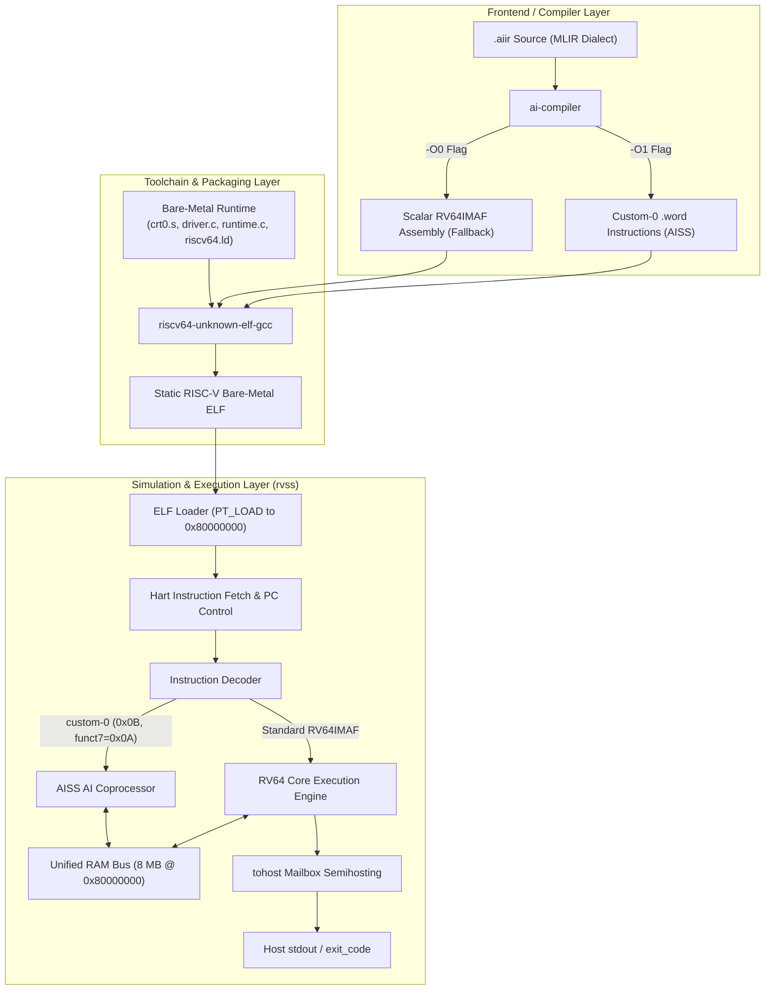

# System & Hardware Architecture: AISS (AI-Instruction Set Sub-extension)

This document specifies the architectural block diagrams, microarchitectural dataflow, compilation pipeline, and memory subsystem for the **AISS** RISC-V AI acceleration platform.

---

## Table of Contents

1. [High-Level System Architecture](#1-high-level-system-architecture)
2. [Processor & AI Accelerator Microarchitecture](#2-processor--ai-accelerator-microarchitecture)
3. [AI Unit (AISS Datapath) Microarchitecture](#3-ai-unit-aiss-datapath-microarchitecture)
4. [Compiler Pipeline & Dual-Path Lowering Architecture](#4-compiler-pipeline--dual-path-lowering-architecture)
5. [Memory Subsystem & Stack Frame Layout](#5-memory-subsystem--stack-frame-layout)
6. [Instruction Encoding & Register ABI Interface](#6-instruction-encoding--register-abi-interface)
7. [Semihosting & Verification Architecture](#7-semihosting--verification-architecture)

---

## 1. High-Level System Architecture

The system consists of an end-to-end flow spanning high-level machine learning intermediate representation (MLIR-style `.aiir`), dual-mode assembly code generation, bare-metal runtime integration, and an execution simulator implementing a standard RISC-V RV64IMAF core coupled with an on-chip custom AI coprocessor.

```
       +-------------------------------------------------------------+
       |                      USER APPLICATION                       |
       |                MLIR-Flavoured AI IR (.aiir)                 |
       |         e.g., demo1.aiir, demo2.aiir, demo3.aiir            |
       +------------------------------+------------------------------+
                                      |
                                      v
       +-------------------------------------------------------------+
       |                     ai-compiler                             |
       |  Lexer, Parser, Stack Allocator, Code Generation Engine     |
       |                                                             |
       |      [ -O1: Hardware Mode ]       [ -O0: Software Fallback ]|
       |     Raw custom-0 (.word) ops       Scalar RV64IMAF FP loops |
       +------------------------------+------------------------------+
                                      | (Assembly: .kernel.s)
                                      v
       +-------------------------------------------------------------+
       |                   GNU TOOLCHAIN (Bare-Metal)                |
       |           riscv64-unknown-elf-gcc / as / ld                 |
       |  Links: crt0.s + kernel.o + runtime.c + driver.c + ldscript |
       +------------------------------+------------------------------+
                                      | (Bare-metal Static ELF)
                                      v
+===========================================================================+
|                     rvss — RISC-V CHIP SIMULATOR                          |
|                                                                           |
|  +--------------------+    +------------------+    +-------------------+  |
|  |     ELF LOADER     |--->|  RV64 CORE HART  |--->|    tohost HOST    |  |
|  |  Loads PT_LOAD to  |    |  RV64IMAF Engine |    |    SEMIHOSTING    |  |
|  |   RAM 0x80000000   |    +--------+---------+    |  Stdout / Exit    |  |
|  +--------------------+             |              +---------^---------+  |
|                                     | custom-0               |            |
|                                     | (0x0B)                 |            |
|                            +--------v---------+              |            |
|                            |  SIMULATED AISS  |              |            |
|                            |  AI COPROCESSOR  |              |            |
|                            | add/mul/relu/gemm|              |            |
|                            +--------+---------+              |            |
|                                     |                        |            |
|                               +-----v------+                 |            |
|                               | 8 MB RAM   |-----------------+            |
|                               | 0x80000000 |                              |
|                               +------------+                              |
+===========================================================================+
```

### Mermaid Diagram: System Pipeline



---

## 2. Processor & AI Accelerator Microarchitecture

The execution core models an unprivileged single-hart **RV64IMAF** pipeline tightly integrated with an attached **AISS Coprocessor** sharing the unified memory controller.

```
                   +------------------------------------+
                   |          Program Counter (PC)      |
                   +-----------------+------------------+
                                     |
                                     v
                   +------------------------------------+
                   |     Instruction Fetch Unit (IF)    |
                   +-----------------+------------------+
                                     | 32-bit insn
                                     v
                   +------------------------------------+
                   |        Instruction Decoder         |
                   +--------+------------------+--------+
                            |                  |
             Standard RV64  |                  | custom-0 (opcode 0x0B)
             Opcode Path    |                  | funct7 = 0x0A
                            v                  v
    +-----------------------------+      +-------------------------------+
    |      RV64 EXECUTION UNIT    |      |     AISS AI ACCELERATOR       |
    |  - RV64I: ALU, Shift, Branch|      |  - Vector Add Engine (0)      |
    |  - RV64M: Mul / Div Engine  |      |  - Vector ReLU Unit (1)       |
    |  - RV64F/D: IEEE-754 FPU    |      |  - Vector Mul Engine (2)      |
    |    (FMA, NaN-boxing)        |      |  - Systolic/GEMM MatMul (3)   |
    +--------------+--------------+      +---------------+---------------+
                   |                                     |
                   | Read / Write                        | Read / Write
                   v                                     v
    +-----------------------------+      +-------------------------------+
    |       ARCHITECTURAL STATE   |      |      AI ACCELERATOR ABI MAP   |
    |  - Integer Regfile: x0 - x31|      |  - x5  (t0) : VLEN / Count    |
    |  - FP Regfile:      f0 - f31|=====>|  - x6  (t1) : srcA pointer    |
    |  - PC (Program Counter)     |      |  - x7  (t2) : srcB pointer    |
    |                             |      |  - x28 (t3) : dst pointer     |
    +--------------+--------------+      |  - x29 (t4) : MatMul M        |
                   |                     |  - x30 (t5) : MatMul K        |
                   |                     |  - x31 (t6) : MatMul N        |
                   |                     +---------------+---------------+
                   | Load / Store                        | Vector DMA /
                   | Requests                            | Burst Stream
                   v                                     v
    +--------------------------------------------------------------------+
    |                    UNIFIED MEMORY INTERFACE / BUS                  |
    +---------------------------------+----------------------------------+
                                      |
                                      v
    +--------------------------------------------------------------------+
    |                     PHYSICAL RAM (8 MB)                            |
    |                   0x80000000 - 0x807FFFFF                          |
    |  - .text (Code)                                                    |
    |  - .rodata (Constants)                                             |
    |  - .data / .bss (Global Data, tohost/fromhost)                     |
    |  - Program Stack (Grows down from 0x807FFFF0)                      |
    +--------------------------------------------------------------------+
```

### Microarchitecture Highlights:
* **Zero Context Switch Overhead**: The AI unit operates statelessly using standard caller-saved registers (`t0`–`t6`). No extra CSRs or architectural save/restore mechanisms are required across kernel boundaries.
* **Direct Tensor Addressing**: Pointer registers (`t1`, `t2`, `t3`) supply 64-bit absolute RAM addresses directly to the AI datapath, enabling zero-copy tensor compute.
* **IEEE-754 Binary32 Compliance**: All AI operations execute bit-exact single-precision floating point arithmetic adhering to standard rounding semantics.

---

## 3. AI Unit (AISS Datapath) Microarchitecture

The AISS coprocessor houses four functional execution units operating over packed single-precision (f32) vectors and matrices.

```
                              AISS Custom Instruction
                     (opcode=0x0B, funct7=0x0A, funct3=0..3)
                                        |
                 +----------------------+----------------------+
                 |                      |                      |
                 v                      v                      v
            srcA Ptr (x6)          srcB Ptr (x7)          dst Ptr (x28)
                 |                      |                      |
                 |                      |                      |
                 +----------+     +-----+                      |
                            |     |                            |
                            v     v                            |
                     +---------------+                         |
                     |  Memory Load  |                         |
                     | Burst Buffers |                         |
                     +-------+-------+                         |
                             |                                 |
           +-----------------+-----------------+               |
           |                 |                 |               |
           v                 v                 v               |
    +--------------+  +--------------+  +--------------+       |
    | Vector Add   |  | Vector Mul   |  | Vector ReLU  |       |
    | Unit         |  | Unit         |  | Unit         |       |
    | funct3 = 0   |  | funct3 = 2   |  | funct3 = 1   |       |
    | dst = A + B  |  | dst = A * B  |  | dst=max(0,A) |       |
    | (len in x5)  |  | (len in x5)  |  | (len in x5)  |       |
    +-------+------+  +-------+------+  +-------+------+       |
            |                 |                 |              |
            +-----------------+-----------------+              |
                              |                                |
                              v                                |
                     +-----------------+                       |
                     | GEMM / MatMul   |<--- Dims:             |
                     | Systolic Core   |     x29 = M           |
                     | funct3 = 3      |     x30 = K           |
                     | C = A @ B       |     x31 = N           |
                     +--------+--------+                       |
                              |                                |
                              v                                |
                     +-----------------+                       |
                     |  Memory Store   |<----------------------+
                     | Writeback Buffer|
                     +--------+--------+
                              |
                              v
                     RAM (Tightly-Packed f32)
```

### Operation Semantics:

| Instruction | funct3 | Operands / Configuration | Operation Mathematical Definition |
|:---|:---:|:---|:---|
| `ai.add` | `0x0` | `n = x5`, `A = x6`, `B = x7`, `dst = x28` | $\forall i \in [0, n): \text{dst}[i] = A[i] + B[i]$ |
| `ai.relu` | `0x1` | `n = x5`, `A = x6`, `dst = x28` | $\forall i \in [0, n): \text{dst}[i] = \max(0.0, A[i])$ |
| `ai.mul` | `0x2` | `n = x5`, `A = x6`, `B = x7`, `dst = x28` | $\forall i \in [0, n): \text{dst}[i] = A[i] \times B[i]$ |
| `ai.matmul` | `0x3` | $M = \text{x}29, K = \text{x}30, N = \text{x}31$, $A=\text{x}6, B=\text{x}7, \text{dst}=\text{x}28$ | $\forall m \in [0, M), n \in [0, N): \text{dst}[m, n] = \sum_{k=0}^{K-1} A[m, k] \cdot B[k, n]$ |

---

## 4. Compiler Pipeline & Dual-Path Lowering Architecture

The compiler (`ai-compiler.c`) provides a bridge between MLIR tensor dialects and RISC-V machine instructions.

```
                           Input Source File (.aiir)
                          (e.g., demos/demo3.aiir)
                                     |
                                     v
                        +---------------------------+
                        |  Lexer & Parser Frontend  |
                        | - Strips comments         |
                        | - Tracks SSA temps (%0..%t|
                        | - Parses tensor dimensions|
                        +-------------+-------------+
                                      |
                                      v
                        +---------------------------+
                        |  Stack Frame Slot Manager |
                        | - Tensor temps: sp - 16.. |
                        | - Scalar temps: sp - 1024.|
                        +-------------+-------------+
                                      |
                 +--------------------+--------------------+
                 |                                         |
     [-O1 Flag Passed]                         [-O0 Flag (Default)]
                 |                                         |
                 v                                         v
   +---------------------------+             +---------------------------+
   |  AISS Hardware Lowering   |             | Software Fallback Lowering|
   +---------------------------+             +---------------------------+
   | Setup registers:          |             | Emit scalar RV64 loops:   |
   | - li t0, VLEN             |             | - flw fa0, 0(t1)          |
   | - mv/addi t1, srcA        |             | - flw fa1, 0(t2)          |
   | - mv/addi t2, srcB        |             | - fadd.s / fmul.s         |
   | - addi t3, dst            |             | - fmadd.s / fmv.w.x       |
   | - li t4, M / t5, K / t6, N|             | - fsw fa2, 0(t3)          |
   | Emit raw R-type opcode:   |             | Loop branch back:         |
   |   .word 0x14730e0b        |             | - bnez t0, .Lsw_loop      |
   +-------------+-------------+             +-------------+-------------+
                 |                                         |
                 +--------------------+--------------------+
                                      |
                                      v
                        +---------------------------+
                        | Output Emission (.s)      |
                        | - Function signature:     |
                        |   void ai_kernel(A,B,OUT) |
                        | - epilogue & ret loop     |
                        +---------------------------+
```

### Dual-Path Comparison:
* **Hardware Mode (`-O1`)**: Reduces multi-cycle nested loops to single instruction dispatches (`.word`), delegating memory streaming and execution to the accelerator datapath.
* **Software Mode (`-O0`)**: Guarantees universal compatibility by lowering identical high-level semantics onto standard RISC-V scalar floating-point instructions (`RV64F`).

---

## 5. Memory Subsystem & Stack Frame Layout

### Physical Address Space Layout (8 MB RAM)

The machine defines an 8 MB contiguous RAM boundary starting at address `0x80000000`.

```
0x80800000 +---------------------------------------------------------+
           | RESERVED TOP                                            |
0x807FFFF0 +---------------------------------------------------------+ <--- STACK_TOP / sp (initial)
           |                                                         |
           | PROGRAM STACK (Grows downward)                          |
           |   - Local activation records                            |
           |   - Kernel intermediate tensor scratchpads              |
           |   - Kernel scalar temporary slots                       |
           |                                                         |
           |                         |                               |
           |                         v                               |
           |                                                         |
           | ....................................................... |
           |                    FREE RAM REGION                      |
           | ....................................................... |
           |                                                         |
           | BSS / COMMON DATA (NOLOAD)                              |
           |   - Zero-initialized variables                          |
           +---------------------------------------------------------+
           | DATA SEGMENT (.data, .sdata)                            |
           |   - tohost / fromhost semihosting mailbox (64B aligned) |
           |   - Global constants & initialized buffers              |
           +---------------------------------------------------------+
           | READ-ONLY DATA (.rodata)                                |
           |   - String literals, formatting strings                 |
           +---------------------------------------------------------+
           | TEXT SEGMENT (.text)                                    |
           |   - _start bootstrap (crt0.s)                           |
           |   - main() driver runtime (driver.c)                    |
           |   - ai_kernel compiled code (.kernel.s)                 |
           |   - semihosting utilities (runtime.c)                   |
0x80000000 +---------------------------------------------------------+ <--- RAM_BASE (Entry Point)
```

### Kernel Activation Stack Frame (during `ai_kernel`)

```
      sp ----> +----------------------------------------------------+  (sp + 0)
               | Reserved / Linkage Alignment Space                 |
 sp - 16 ----> +----------------------------------------------------+  (sp - 16)
               | Tensor Slot for Temp %2 (16 x f32 = 64 bytes)      |
 sp - 80 ----> +----------------------------------------------------+  (sp - 80)
               | Tensor Slot for Temp %3 (16 x f32 = 64 bytes)      |
 sp - 144 ---> +----------------------------------------------------+  (sp - 144)
               | Tensor Slot for Temp %4 (16 x f32 = 64 bytes)      |
               | ...                                                |
               | Tensor Slot for Temp %t : [sp - 16 - 64 * (t - 2)] |
               +----------------------------------------------------+
               | ...                                                |
 sp - 1024 --> +----------------------------------------------------+  (sp - 1024)
               | Scalar Slot for Temp %0 (4 bytes)                  |
 sp - 1028 --> +----------------------------------------------------+  (sp - 1028)
               | Scalar Slot for Temp %1 (4 bytes)                  |
               | ...                                                |
               | Scalar Slot for Temp %t : [sp - 1024 - 4 * t]      |
               +----------------------------------------------------+
```

---

## 6. Instruction Encoding & Register ABI Interface

### Custom-0 Instruction Encoding (R-Type)

The AISS instruction set adheres to the RISC-V 32-bit R-type instruction format reserved for implementation-specific coprocessors (`custom-0` = `0x0B`).

```
 31             25 24         20 19         15 14   12 11          7 6            0
+-----------------+-------------+-------------+-------+-------------+--------------+
|     funct7      |     rs2     |     rs1     |funct3 |     rd      |    opcode    |
|     7 bits      |    5 bits   |    5 bits   |3 bits |    5 bits   |    7 bits    |
+-----------------+-------------+-------------+-------+-------------+--------------+
|     0001010     |   (srcB)    |   (srcA)    |  op   |    (dst)    |   0001011    |
|      0x0A       |   opt/reg   |   opt/reg   | 0..3  |   opt/reg   | 0x0B (cust0) |
+-----------------+-------------+-------------+-------+-------------+--------------+
```

### Dedicated Register ABI Mapping

To enable whole-tensor operations (including multidimensional matrix dimensions) without register spill overhead, the architecture utilizes a dedicated calling convention:

```
+---------------+---------------+------------------------------------------------------+
| Register Name | ABI Mnemonic  | Functional Role in AISS Coprocessor                  |
+---------------+---------------+------------------------------------------------------+
| x5            | t0            | Element Count (Vector length n for add, relu, mul)   |
| x6            | t1            | Base Address Pointer: Source Tensor A                |
| x7            | t2            | Base Address Pointer: Source Tensor B                |
| x28           | t3            | Base Address Pointer: Destination Tensor (Result)    |
| x29           | t4            | Matrix Dimension M (Rows of Matrix A)                |
| x30           | t5            | Matrix Dimension K (Columns of A / Rows of B)        |
| x31           | t6            | Matrix Dimension N (Columns of Matrix B)             |
+---------------+---------------+------------------------------------------------------+
```

*Note*: Because `t0`–`t6` are defined as caller-saved temporary registers in the standard RISC-V ABI, the hardware AI coprocessor requires no operating system context-switching or register saving support.

---

## 7. Semihosting & Verification Architecture

The simulator and runtime interface via an asynchronous bidirectional mailbox structure (`tohost` / `fromhost`) mapped in the `.data` segment.

```
       SIMULATED RISC-V BARE-METAL PROGRAM                 HOST SIMULATOR (rvss)
   +-----------------------------------------+       +--------------------------------+
   | runtime.c (print_str / exit_sim)        |       | rvss.c (step() execution loop) |
   |                                         |       |                                |
   | 1. Write buffer ptr to tohost[1]        |       | 1. Retired instruction counter |
   | 2. Write payload length to tohost[2]    |       |    increments                  |
   | 3. Write command (0x03) to tohost[0]    |       | 2. Polls load(tohost_addr, 8)  |
   |                                         |       |                                |
   |    tohost[0] = 0x03 (SYS_WRITE)         |====>  | 3. Detects command:            |
   |                                         |       |    - 0x01 / 0x02: exit code    |
   |                                         |       |    - 0x03: host write() syscall|
   | 4. Spin-wait: while (tohost[0]) { }     |       |                                |
   |                                         |<====  | 4. rvss clears tohost[0] = 0   |
   | 5. Program continues execution          |       +--------------------------------+
   +-----------------------------------------+
```

### Command Encodings:
* `tohost[0] == 1`: Successful termination (`exit(0)`).
* `tohost[0] == 2`: Terminate with specific error status (`exit(tohost[1])`).
* `tohost[0] == 3`: Semihosting console write (`write(stdout, tohost[1], tohost[2])`). Once processed by `rvss`, `tohost[0]` is cleared to acknowledge completion.
